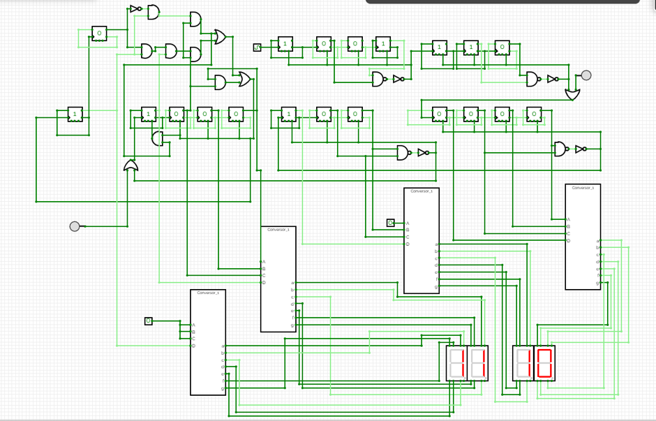

# Digital Clock Using Flip Flops

## Introduction:
In this project, I tried to implement my understanding of Digital System Design. In this course I learned about making combinational circuits, sequential circuits, counters, latches etc. This project is about building a digital clock with D-Flip Flops and basic logic gates. The design is built on CircuitVerse, an online digital simulation software. 

## Components:
D-Flip Flops, AND gates, OR gates, 7 Segment display, BCD decoders, Digital clock generator.

## Working Principle:
The basic working principle of counters is used. Flip-Flops are cascaded to design counters. Output complemented cascading leads to an up-counter and direct output cascading leads to a down-counter. Different counters have been cascaded in the way to count seconds, minutes and hours like a digital clock. BCD counter is used for units place of seconds, minutes and hours. MOD-6 counter is used for tens place of seconds and minutes and MOD-2 counter is used for tens place of hours. 
D-flip flop is used in toggling state and being cascaded with complemented output of one flip flop passed to next flip flop to make counter. This type of counter is called ripple counter where clock pulse is applied to only one flip flop and rest get their clock pulse from output of previous flip flop.

**Input**        **Output**

0       	   0

1	1

Above, is the truth table of D flip flop, present output of flip flop does not depend upon previous output of D flip flop. Output at current stage is same as the input applied just before the active clock edge. 

 
This is the circuit diagram of the digital clock.

Link to Circuit: 
https://circuitverse.org/users/417330/projects/digital-clock-d-flip-flop

## Counter Logic:
Clock is supplied to a MOD-9 counter made by truncating a 4-bit (MOD-16) counter. As soon as its count reaches 1010 reset circuit is triggered which resets the current counter and acts as a clock pulse for the cascaded MOD-6 counter.
When MOD-6 counter reaches 110, reset circuit triggers which resets the current counter and generates clock pulse for next counter. In this way seconds are counted. Currently I did not dealt with the concept of clock pulse generation. It is set to 1000ms in the simulator.
In the same manner, seconds circuit generate clock pulse for minutes circuit and minutes circuit generate clock for hours circuit. All the circuits contain truncated counters. 

## Display Logic: 
To display time as output we need to convert counted binary digits into decimal number for which I used BCD decoder which converts binary coded decimal values back to decimal. I tried to design BCD decoder using Verilog program but due to simulation constraints my design did not work, so I used a predesigned BCD decoder from web. 

## Challenges Faced:
Designing and cascading counter was easy since, I just learned them through out the semester. The challenge was to bridge the gap between a clock and those counters. The first design I made was working but it used to reset after 11:00 to 00:00 which is correct for a real clock with 12 hour format but at night but it must not reset during day time. Thinking in terms of hardware to reduce it as much as possible is challenging. The current design might use extra gates for performing tasks.

<!-- Improvements and Further Objectives
Current version takes clock pulse as input and counts time. Two buttons are added to set time. Currently, a lot features needs to be added which includes:
1. Display AM\ PM
2. Set alarms
3. Display Day

Also, I wish to modulate the circuits which would decrease mess in the circuit and would help me to relate the hardware with available ICs in the market.  -->

<!-- 
Author:
MADHUSUDAN -->
